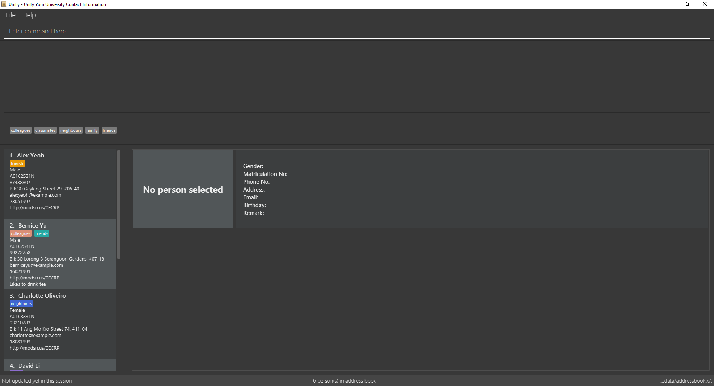
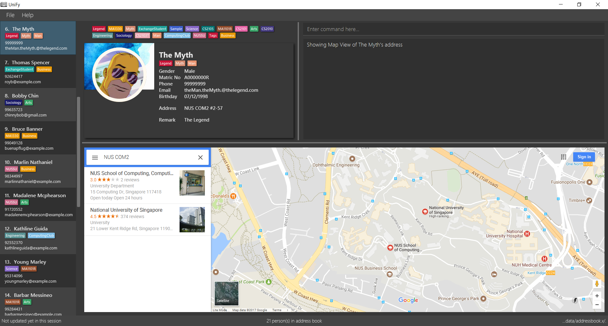

# UniFy
ifdef::env-github,env-browser[:relfileprefix: docs/]
ifdef::env-github,env-browser[:outfilesuffix: .adoc]

https://travis-ci.org/CS2103AUG2017-W09-B1/main[image:https://travis-ci.org/CS2103AUG2017-W09-B1/main.svg?branch=master["Build Status"]]
https://ci.appveyor.com/project/zacharytang/main[image:https://ci.appveyor.com/api/projects/status/1kk36eq1wha8tcut?svg=true[Build status]]
https://coveralls.io/github/CS2103AUG2017-W09-B1/main?branch=master[image:https://coveralls.io/repos/github/CS2103AUG2017-W09-B1/main/badge.svg?branch=master[Coverage Status]]
https://www.codacy.com/app/zacharytang/main?utm_source=github.com&amp;utm_medium=referral&amp;utm_content=CS2103AUG2017-W09-B1/main&amp;utm_campaign=Badge_Grade)[image:https://api.codacy.com/project/badge/Grade/67e717e8e66245b9881839446b7fb464[Codacy Badge]]

ifdef::env-github[]

endif::[]

ifndef::env-github[]
image::images/Ui.png[width="600"]

image::images/UiDark.png[width="600"]
endif::[]

__Unifying your University Contact Information, and more. For You.__

* This is a desktop Address Book application for University students, particularly those from NUS (National University of Singapore).
* Manage the many people you meet in University, keep track of your friends' Birthdays, view your friend's timetables, plus much more!
* Most of your user interactions are via command line, while there exists a GUI (Graphical User Interface).

== Site Map

* <<UserGuide#, User Guide>>
* <<DeveloperGuide#, Developer Guide>>
* <<AboutUs#, About Us>>
* <<ContactUs#, Contact Us>>

== For Developers
* This Java application is *written in OOP fashion*. The code base is *reasonably well-written* and *significantly big* (around 6 KLoC).

== Acknowledgements

* Some parts of this sample application were inspired by the excellent http://code.makery.ch/library/javafx-8-tutorial/[Java FX tutorial] by
_Marco Jakob_.
* Source code is based on the  https://github.com/se-edu/addressbook-level4[AddressBook-Level4] project created by SE-EDU initiative.

== Licence : link:LICENSE[MIT]
